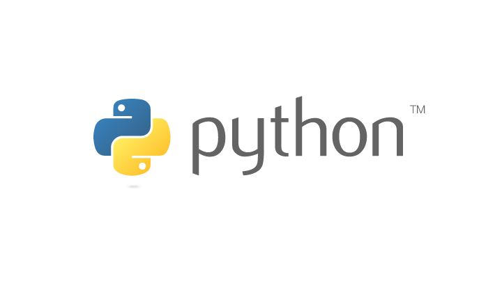

<h1 align="center">
    
   
  Shinetek 软件编程规范
   
   
</h1>

|||
|---|---|---|---|---|

<!-- <h2 align="left">
    
    <a herf="./doc/standard-js.md" style="font-size: 1.2em">JavaScript 编码规范</a>
</h2>
 
<h2 align="left">
    
    <a herf="./doc/standard-js.md" style="font-size: 1.2em">Python 编码规范</a>
</h2>
 
<h2 align="left">
    
    <a herf="./doc/standard-js.md" style="font-size: 1.2em">版本控制操作规范</a>
</h2> -->