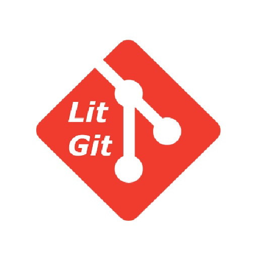
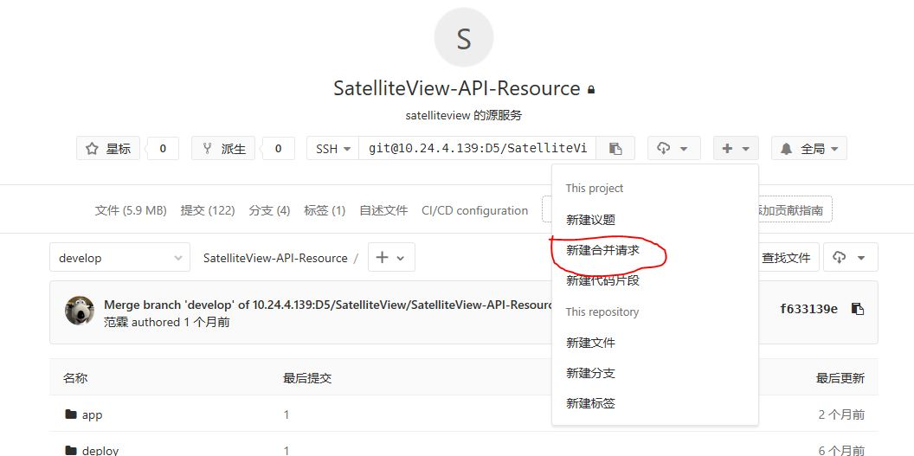
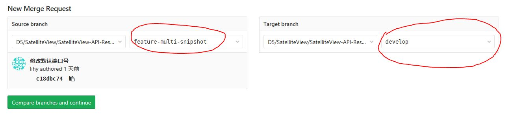
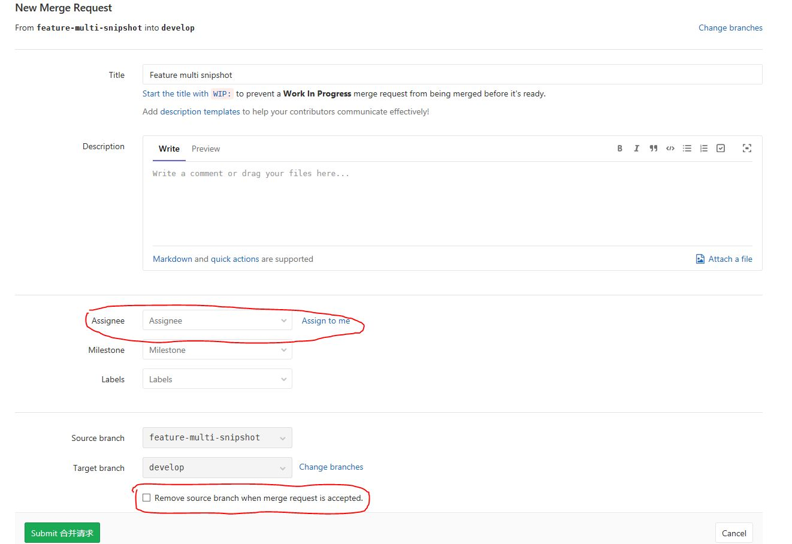
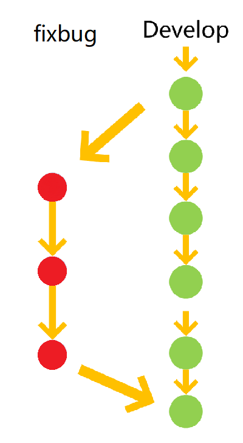

<h1 align="center">
  
  <br>
  <br>
  版本控制操作规范
  <br>
  <br>
</h1>

# git 使用流程规范

团队开发中，遵循一个合理、清晰的Git使用流程，是非常重要的。

否则，每个人都提交一堆杂乱无章的commit，项目很快就会变得难以协调和维护。

本流程规范参考了 《阮一峰：Git 使用规范流程》，并针对实际情况稍作了调整。

<font color=#CC3333  size=4 face="黑体">使用本流程规范时，墙裂建议大家使用命令行进行操作，有助于快速理解git。</font>

## 第一步 拉取 develop 到本地

```ssh
  //首次获取代码
  $git clone git@10.24.4.139:D5/orbscjs.git

  //持续开发过程中
  $git checkout develop
  $git pull
```

## 第二步 创建本地分支

每次**开发新功能**或是**问题修复**，都应该新建一个单独的分支（这方面可以参考 [分支管理策略](#Branch-Manager)）。

```ssh
  $git checkout -b feature-xxxxx

  $git checkout -b fixbug-xxxxx
```

## 第三步 编码并保持Commit

日常开发时保持在新建的本地分支中进行。中断开发记得提交修改

```ssh
  $git commit -m "描述提交内容"
```

## 第四步 保持与 develop 的同步

分支的开发过程中，要经常与 **develop** 保持同步

```ssh
  $git checkout develop // 切换到develop主干
  $git pull // 更新 develop
  $git checkout feature-xxxxx // 切换回你的分支
  $git merge develop // 将 develop 合并到你的分支
```

* 如果在合并 develop 的过程中出现代码冲突，利用编辑器自带的工具解决
* 推送到gitlab前必须进行一次同步，确保代码与主干一致

## 第六步 本地测试通过后，推送到gitlab

编码完成后，就可以推送当前分支到远程仓库了。

```ssh
  $git push --set-upstream origin feature-xxxxx
```

## 第七步 发起合并请求到develop

提交到远程仓库以后，就可以发出 **Pull Request** 到 **develop** 分支，然后请求别人进行代码review，通过审核和方可并入 **develop** 分支

具体操作如下：



* **注意源和目标不要选错，把A合并到B Source 选 A、Target 选 B**



注意以下几点：

* Description 写清楚你提交的这个分支都干了哪些事儿，逐条列明，便于他人审核
* Assignee 选择一个 负责审核代码的成员（选填, 也可口头通知）
* Remove source branch when merge request is accepted. 审核通过并执行合并请求后自动删除源分支（建议勾选）



## 第八步 合并通过后删除本地分支

```ssh
  $git branch -d <BranchName> // 删除本地分支
  $git remote prune origin  // 清除远程已经删除的分支
```

# 分支管理策略 <span id="Branck-Manager"></span>

请参考以下分支管理策略对软件版本进行管理。它可以使得版本库的演进保持简洁，主干清晰，各个分支各司其职、井井有条。理论上，这些策略对所有的版本管理系统都适用，Git只是用来举例而已。

## 主分支Master

* 代码库应该有一个、且仅有一个主分支。所有提供给用户使用的正式版本，都在这个主分支上发布。
* Git主分支的名字，默认叫做Master。它是自动建立的，版本库初始化以后，默认就是在主分支在进行开发。(**应避免这种情况**)


## 开发分支Develop

* 主分支只用来分布重大版本，日常开发应该在另一条分支上完成。我们把开发用的分支，叫做Develop。
* 这个分支可以用来生成代码的最新隔夜版本（nightly）。如果想正式对外发布，就在Master分支上，对Develop分支进行"合并"（merge）。
* **所有提交到Master分支上的合并请求必须经过审查后方可进行合并**


## 功能分支

* 为了开发某种特定功能，从 Develop 分支上面分出来的。开发完成后，要再并入Develop
* 功能分支的名字，采用 feature-* 的形式命名
* 合并进 Develop 后删除


## 修补bug分支

* 已提交的代码难免会出现bug，这时就需要创建一个分支对bug进行修复。
* 修补bug分支的名字采用 fixbug-* 的形式命名
* 合并进 Develop 后删除



## gitlab中的设置
