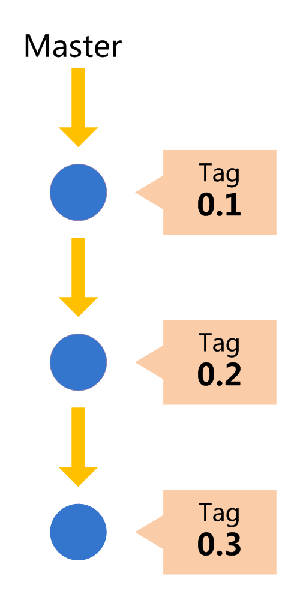

# <a> 版本控制操作规范</a>

## git 使用流程规范

团队开发中，遵循一个合理、清晰的Git使用流程，是非常重要的。

否则，每个人都提交一堆杂乱无章的commit，项目很快就会变得难以协调和维护。

本流程规范参考了 《阮一峰：Git 使用规范流程》，并针对实际情况稍作了调整。

<font color=#CC3333  size=4 face="黑体">★ 使用本流程规范时，墙裂建议大家使用命令行进行操作，有助于快速理解git。</font>
<br>

<font color=#CC3333  size=4 face="黑体">★ 团队协作开发时必须遵从以下规则。</font>

### 第一步 拉取 master 到本地

```ssh
  //首次获取代码
  $git clone git@10.24.4.139:D5/orbscjs.git
  $git checkout master

  //持续开发过程中
  $git checkout master
  $git pull
```

### 第二步 创建本地分支

每次**开发新功能**或是**问题修复**，都应该新建一个单独的分支（这方面可以参考 [分支管理策略](#Branch-Manager)）。

```ssh
  $git checkout -b feature-xxxxx
  or
  $git checkout -b fixbug-xxxxx
  or
  $git checkout -b dev-xxxxx
```

### 第三步 编码并保持Commit

日常开发时保持在新建的本地分支中进行。中断开发时记得提交修改

```ssh
  $git commit -m "描述提交内容"
```

### 第四步 保持与 master 的同步

分支的开发过程中，要经常与 **master** 保持同步

```ssh
  $git checkout master // 切换到 master
  $git pull // 更新 master
  $git checkout feature-xxxxx (fixbug-xxxx / dev-xxxx) // 切换回你的分支
  $git merge master // 将 master 合并到你的分支
```

* 如果在合并 master 的过程中出现代码冲突，利用编辑器自带的工具解决
* 推送到gitlab前必须进行一次同步，确保代码与主干一致

### 第六步 本地测试通过后，推送到gitlab

编码完成后，就可以推送当前分支到远程仓库了。

```ssh
  $git push --set-upstream origin feature-xxxxx
  or
  $git push --set-upstream origin fixbug-xxxxx
  or
  $git push --set-upstream origin dev-xxxxx
```

### 第七步 发起合并请求到develop

提交到远程仓库以后，就可以发出 **Merge Request** 到 **master** 分支，然后请求别人进行代码review，通过审核和方可并入 **master** 分支

具体操作如下：


* **注意源和目标不要选错，把A合并到B Source 选 A、Target 选 B**


注意以下几点：

* Description 写清楚你提交的这个合并请求都干了哪些事儿，逐条列明，便于他人审核
* Assignee 选择一个 负责审核代码的成员（选填, 也可口头通知）
* Remove source branch when merge request is accepted. 审核通过并执行合并请求后自动删除源分支（建议勾选）


### 第八步 合并通过后删除本地分支

```ssh
  $git branch -d <BranchName> // 删除本地分支
  $git remote prune origin  // 在本地仓库中清除远程已经删除的分支
```

## 分支管理策略 <span id="Branck-Manager"></span>

请参考以下分支管理策略对软件版本进行管理。它可以使得版本库的演进保持简洁，主干清晰，各个分支各司其职、井井有条。理论上，这些策略对所有的版本管理系统都适用。

### 主干分支

* 代码库应该有一个、且仅有一个主分支。所有提供给用户使用的正式版本，都在这个主分支上发布。
  > master分支的更新与产品的发布是一致的。也就是说，master分支的最新代码，默认就是当前的线上代码

* Git主分支的名字，默认叫做Master。它是自动建立的，版本库初始化以后，默认就是在主分支在进行开发。
  > 应避免直接操作master分支
  > <br>
  > 所有提交到master上的合并请求必须经过审查后方可进行合并

* 主干分支受到保护，不是每个人都可以修改这个分支，日常开发应该在另一条分支上完成。
  > gitlab 初始化时默认master分支为受保护分支



### 日常开发分支

* 为了开发特定功能或修复bug，从 **master** 上面分出来的。开发完成后，要再并入 **master**
* 功能分支的名字，采用 feature-* / fixbug-* / dev-* 的形式命名
  > 重大功能开发时可使用 feature-* 命名分支
  > <br>
  > 修复 issue 中的bug时使用 fixbug-* 命名分支
  > <br>
  > 其他情况使用 dev-* 即可
* 合并进 **master** 后，即删除该分支

 |  |----|----|

### 关于工作流程的说明

本规范使用的工作流程，在很大程度上参考了 **Github flow** 规范，其最大特点就是操作简单，对于"持续发布"的产品，可以说是最合适的流程。

本规范要求所有团队项目，必须同时保持一个长期分支 **master**，以及多个短期分支 *feature-\***、**fixbug-\***

> 前者用于存放对外发布的版本，任何时候在这个分支拿到的，都是稳定的发布版；后者用于日常开发，存放最新的开发版。
> <br>
> 后者用于日常开发。一旦完成，它们就会被合并进 master，然后被删除。

本规范的优点

* 版本库的演进保持简洁，主干清晰，各个分支各司其职、井井有条；
* 任何时候从develop中拉取的代码都将是稳定可用的；
* 最大程度上减少了协同开发过程中出现的代码冲突问题；
